# Datapath and Control

So far we know what kinds of instructions a processor might execute, and how to perform arithmetic and logic in an ALU.

Now, we will learn how to design a processor in which the ALU is just one component.

The datapath implements execute portion of fetch, execute, write loop. This is done through functional units (ALUs), registers, and the memory interface.

Control implements the decode portion of fetch, execute, write loop. This is done through multiplexer selectors and write enable signals.

## One-Instruction-Per-Cycle RISC-V

On every tick of the clock, the processor executes one instruction.

Current state outputs drive the inputs to the combinational logic, whose outputs settle at the values of the state before the next clock edge.

At the rising clock edge, all the state elements are updated with the combinational logic outputs, and execution moves to the next clock cycle.

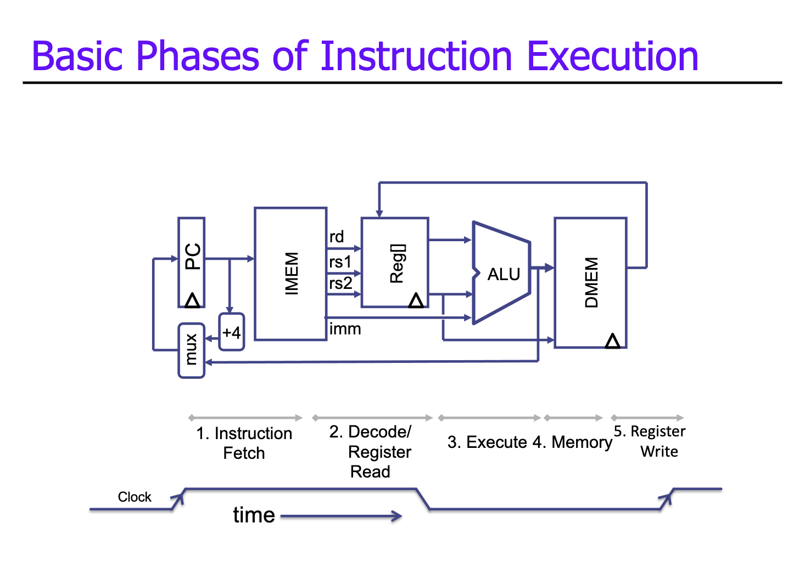

If we want to build a processor for an ISA, we should start with the datapath and make sure it can implement every instruction.

## Datapath for RV32 ISA

Consider these instructions only:

* `add x1,x2,x3`
* `sub x1,x2,x3`
* `addi x1,x2,2`
* `lw x1,4(x3)`
* `sw x1,4(x3)`
* `beq x1,x2,PC_relative_target`
* `jalr x1,4`

Most other instructions are similar from a datapath viewpoint, so we will focus on these examples.

## Registers

A register is a D flip flop (DFF) array with a shared clock and write-enable (WE). A single register is useful for some things (ex: program counter (PC)).

### What about the ISA Registers?

The ISA registers (architectural/visible) form a register file. This file has two read ports and one write port.

Ports are wires for accessing an array of data. $M$ ports = $M$ parallel and independent acceses.

## Memory

Memory is where instructions and data reside. There is one address, one input data bus for writes and one output data bus for reads. There is a one access per cycle, which is either read or write.

Reads are combinational. The output of the read data is a function of the read selected port and the contents of the register file.

Writes are sequential. The selected register (memory location) is updated on the posedge clock transition when write enable is asserted. Thus a write cannot affect the read output in between clock edges.

## Fetch

This consists of the PC and instruction memory (IMEM). A `+4` increment unit computes the default next instruction PC.

In general, the PC provides addresses to the instruction memory.

## First instruction: `add`

> `add rd, rs1, rs2`: `0000000 | rs2 | rs1 | 000 | rd | 0110011`

Semantically: `Reg[rd] = Reg[rs1] + Reg[rs2]`.

Thus, we need to add the register file and ALU to the datapath:

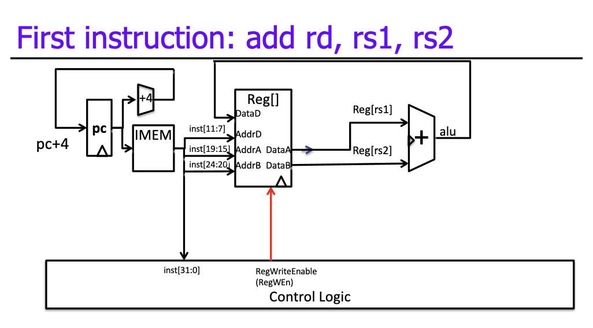
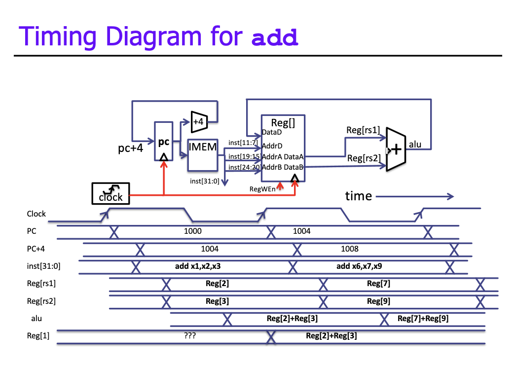

## Second instruction: `sub`

> `sub rd, rs1, rs2`: `0100000 | rs2 | rs1 | 000 | rd | 0110011`

Semantically: `Reg[rd] = Reg[rs1] - Reg[rs2]`.

This is almost the same as `add`; `inst[30]` selects betweeen addition and subtraction.

To support this, we add `ALUSel`:

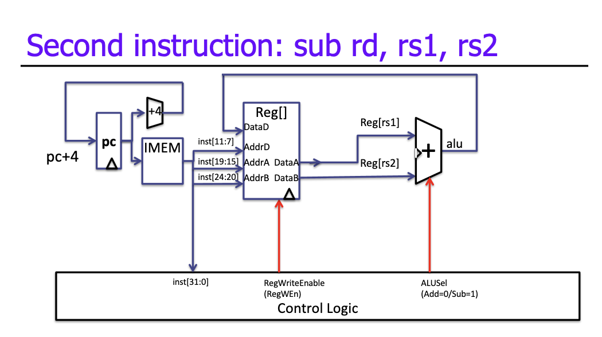

To implement other R-type instructions, we similarly decode `funct3` and `funct7` with a suitable ALU function.

## Third instruction: `addi`

> `addi rd, rs1, imm`: `imm | rs1 | 000 | rd | 0010011`

Semantically: `Reg[rd] = Reg[rs1] + IMMGEN(imm,I)`

To support this, we need to add a sign extension unit and a multiplexer into the second ALU input to select between the regfile output or immediate:

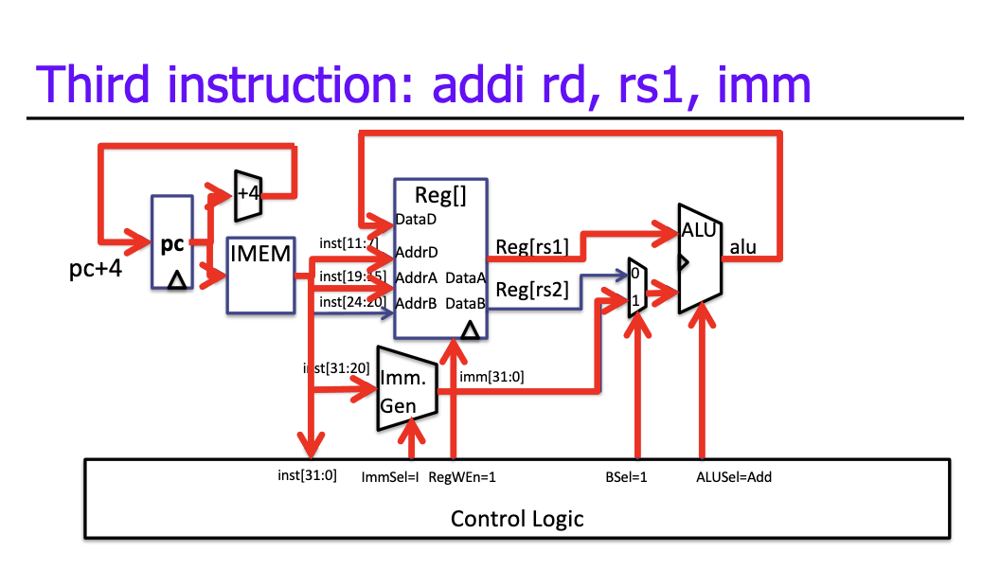

This works for all other I-type airthmetic instructions, all we have to change is `ALUSel`.

### I-Type Immediates

> I-Type: `imm[11:0] | rs1 | funct3 | rd | opcode`

The high 12 bits of the instruction (`inst[31:20]`) is copied to the low 12 bits of the immediate (`imm[11:0]`).

The immediate is sign extended by copying `inst[31]` to the upper 20 bits of the immediate (`imm[31:12]`).

## Fourth instruction: `lw`

> `lw rd, imm(rs1)`: `imm | rs1 | 010 | rd | 0000011`

Semantically: `Reg[rd] = MEM[Reg[rs1] + IMMGEN(imm,I)]`.

To support this, we add data memory, where the address is the ALU output `Reg[rs1] + IMMGEN(imm,I)`. We also add a register write data multiplexer to select between memory output or ALU output.

Load instructions are I-type, so we use the same immediate format and generation.

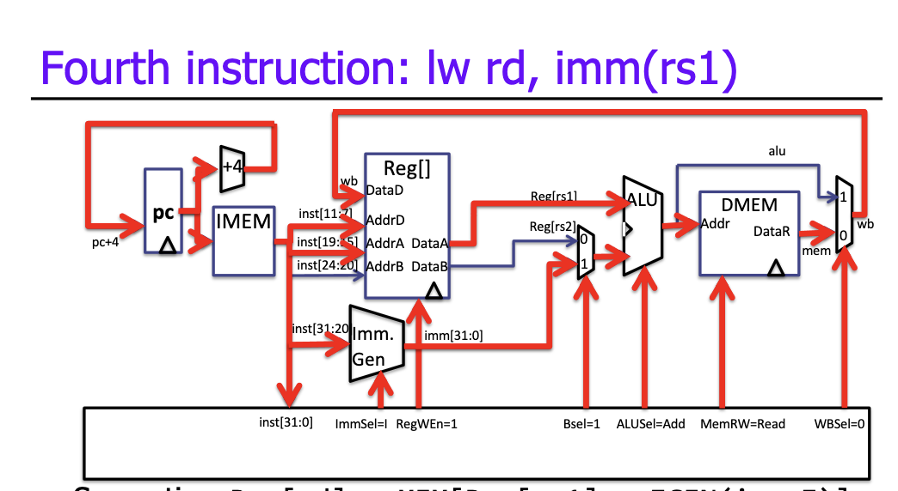

For load instructions, `funct3` encodes size and signedness of the data.

## Fifth instruction: `sw`

> `sw r2, imm(rs1)`: `imm[11:5] | rs2 | rs1 | 010 | imm[4:0] | 0100011`

Semantically: `Reg[rs2] = MEM[Reg[rs1] + IMMGEN(imm,S)]`.

To support this, we add a path from the second register's output to the data memory data input, disable write enable on the register file, and use an S-format immediate:

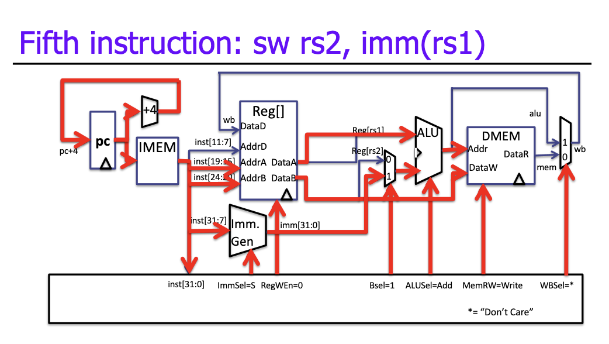

### S-Immediate vs. I-Immediate

> I-Type: `imm[11:0] | rs1 | funct3 | rd | opcode`
>
> S-Type: `imm[11:5] | rs2 | rs1 | funct3 |  imm[4:0] | opcode`
>
> `imm[31:0]` (I-Type): `inst[31](sign-extension) | inst[30:25] | inst[24:20]`
>
> `imm[31:0]` (S-Type): `inst[31](sign-extension) | inst[30:25] | inst[11:7]`

A 5-bit multiplexer selects between two positions where the low 5 bits can reside in an instruction (24:20 or 11:7).

## Sixth instruction: `beq`

> `beq rs1, rs2, target`: `imm[12] | imm[10:5] | rs2 | rs1 | funct3 | imm[4:1] | imm[11] | opcode`

B-Type instructions are similar to S-Type: they both have two register sources and a 12-bit immediate.

Semantically: `(Reg[rs1] == Reg[rs2]) ? PC = PC + IMMGEN(imm, B) : PC + 4`

To support this, we must:

1. Compute the result of the comparison.
2. Write 0 to the least-significant bit.
3. Reuse the ALU to compute the PC-relative branch target.
4. Use a multiplexer to select `Reg[rs1]` or `PC` as the top input to the ALU.
5. Use a multiplexer to select `PC` or branch target address for the next `PC`.

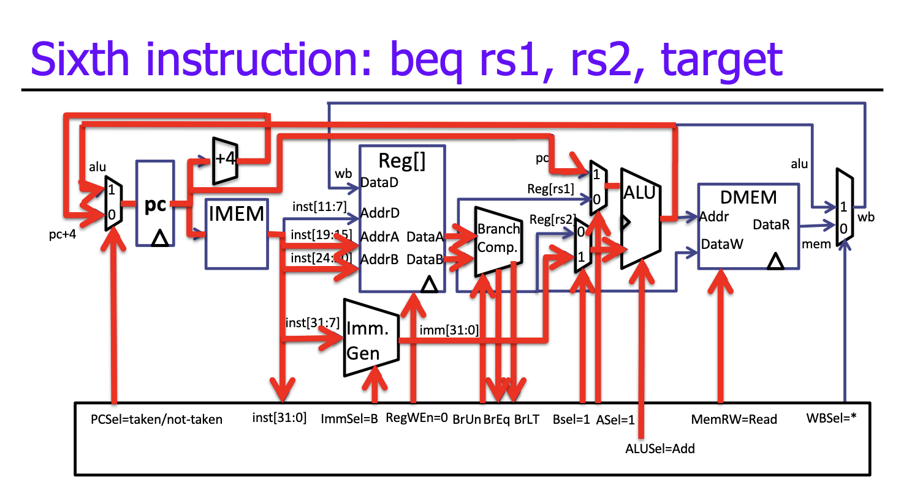

### Branch Comparator

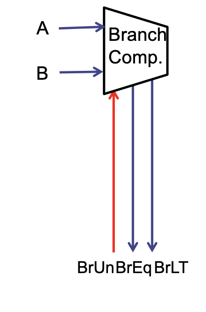

* BrEq = 1 if `A == B`.
* BrLT = 1 if `A < B`.
* BrUn = 1 selects unsigned comparison for BrLt.
* `bge` branch if `!(A < B)`.
* `bne` branch if `!(A == B)`.

### Branch Immediates

A 12-bit immediate encodes PC-relative offset of [-4096, 4096] bytes in 2 byte multiples.

The approach RISC-V takes is essentially to left shift the S-Type immediate by 1 bit. We keep `imm[10:1]` in a fixed position in the output value, wire in 0 for the LSB (`imm[0]`), and sign-extend by `imm[12]` (`inst[31]`).

Only one bit changes position between S-Type and B-Type (`inst[7]`).

## Seventh instruction: `jalr`

> `jalr rd, rs, imm`: `imm[11:0] | rs1 | 000 | rd | 1100111`

Semantically:

* `Reg[rd] = PC + 4`
* `PC = (Reg[rs1] + IMMGEN(imm,I)) & 0xFFFFFFFE`

This uses the same immediate format as I-Type instructions but ignores the least significant bit of the address (hence the `AND`).

To support this, we must add an input `PC + 4` to the write-back multiplexer.

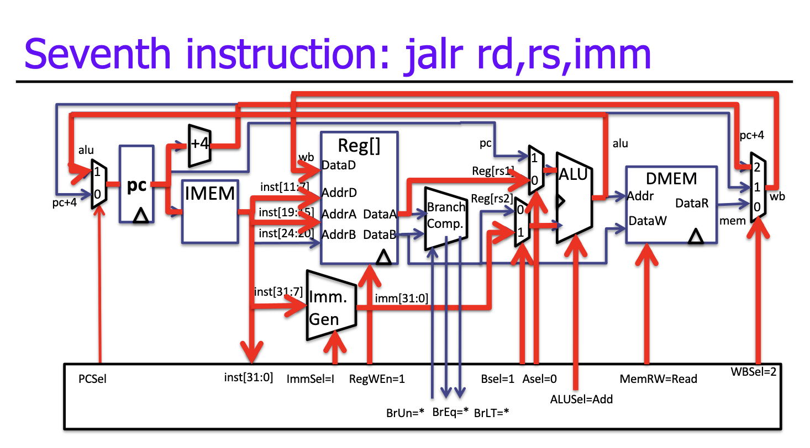

## What does control mean?

As per the above image, 9 signals control the flow of data through the datapath. They are multiplexer selectors or register/memory write enable signals. In modern microprocessors there may be 100s of control signals.

* `PCSel`
* `ImmSel`
* `RegWEn`
* `BrUn`
* `BSel`
* `ASel`
* `MemRW`
* `WBSel`

## Implementing Control

Given a 32-bit instruction, information about the instruction type is encoded with only 9 bits:

* `inst[30]`
* `inst[14:12]`
* `inst[6:2]`

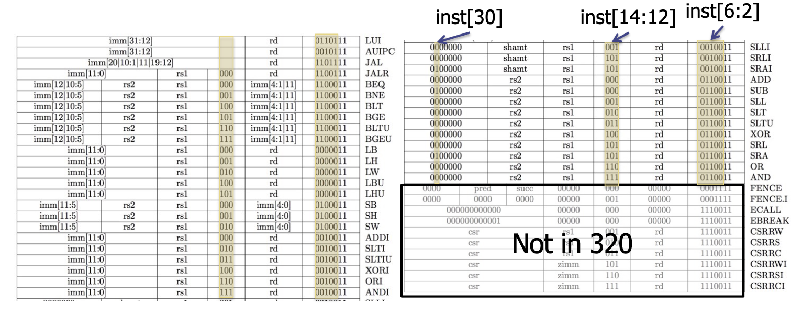

Each instruction has a unique set of control signals. This gives us some options for implmenting control:

1. Use instruction type to look up signals in a table.
2. Design an FSM whose outputs are control signals.

But the goal remains the same: turn instructions into control signals.

### ROM for Control

ROM (read only memory) is like non-writable RAM. Each bit in a word drives a control signal, and the addresses can be indexed by the instruction opcode.

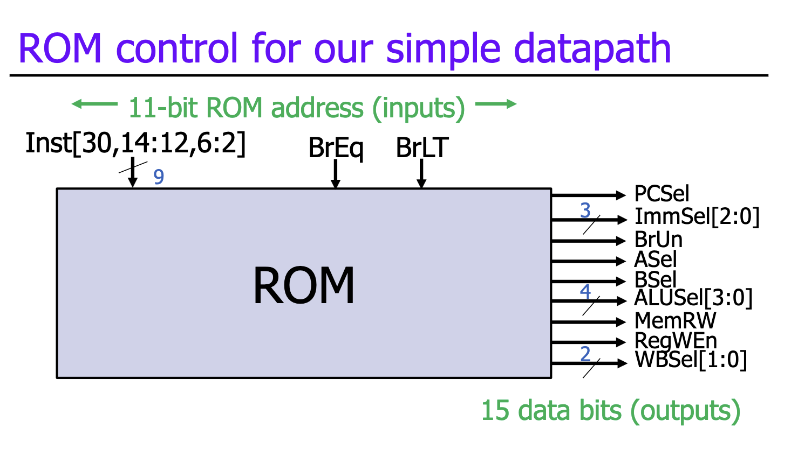
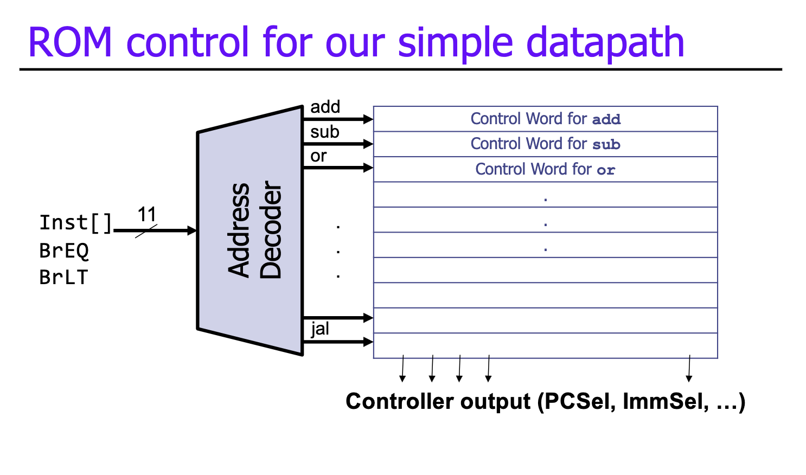

### ROM vs. Combinational Logic

A control ROM is fine for 7 instructions and 9 control signals, but a real computer has over a 100 instructions and 300 control signals, and even RISCs have a lot of instructions. 

In these cases, a control ROM wouldn't be huge but would be hard to make fast, and control must be faster than the datapath.

An alternative is purely combinational control logic.

