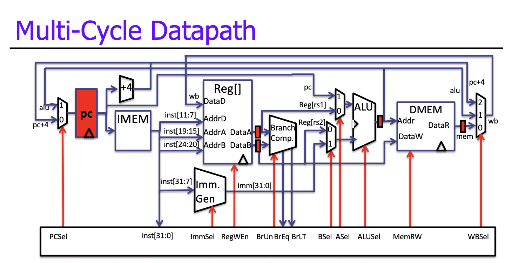
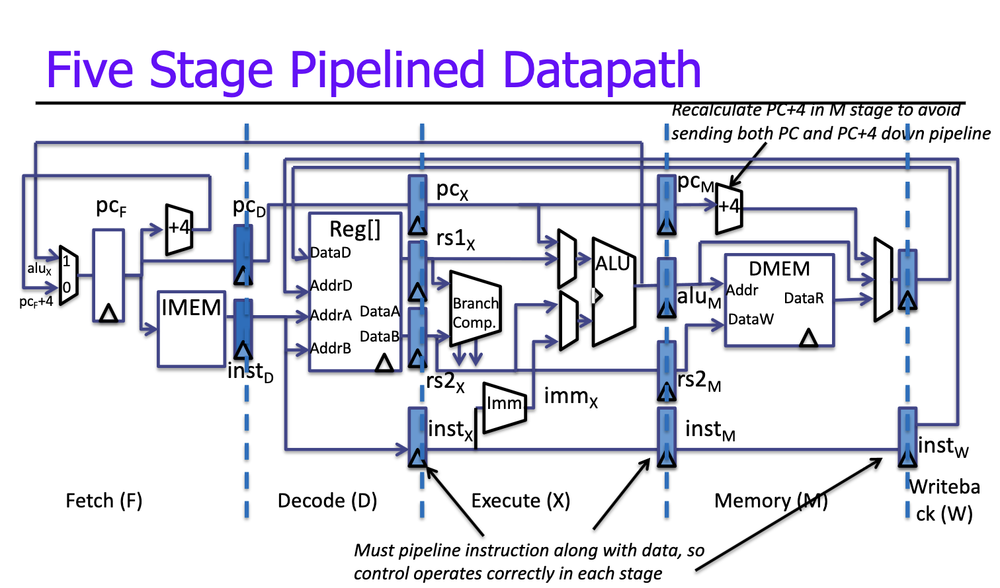
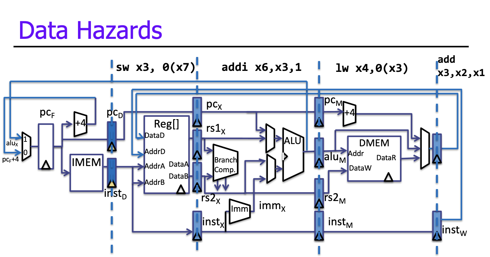

# Pipelining

## Single-Cycle vs. Multi-Cycle Datapath

In a single-cycle datapath, we have a true **atomic** fetch/execute loop, in that the loop completes one instruction every cycle. We also have hardwired control; opcodes directly correspond to control signals. 

The advantage is a low CPI (cycles/instruction) by definition, but that comes with a long clock period to accomodate the slowest instruction.

A multi-cycle datapath attacks a slow clock. The fetch/execute loop completes one instruction over multiple cycles and we have micro-coded control that "stages" control signals. The main difference is that instructions can take different numbers of cycles.

By design, it is the opposite of single-cycle, in that we have a short clock period and high CPI.

### Performance

> Single-Cycle

* Clock period = 50ns, CPI = 1
* Performance = 50ns/instruction

> Multi-Cycle

* Branch: 20% (3 cycles), load: 20% (5 cycles), ALU: 60% (4 cycles)
* Clock period = 11 ns, CPI = (0.2\*3) + (0.2\*5) + (0.6\*4) = 4
* Performance = 44ns/instruction

## Pipelining Basics

In this datapath we have five stages: Fetch, Decode, Execute, Memory, Writeback. The registers are named by the stages they separate (PC, F/D, D/X, X/M, M/W).

The goal of pipelining is to cut a datapath into $N$ stages, here $N = 5$.

* Clock period = $\text{max}(t_\text{IMEM}, t_\text{REGFILE}, t_\text{ALU}, t_\text{DMEM})$
* Base CPI = 1, Actual CPU > 1, pipeline often stalls.
* Individual instruction latency increases (pipeline overhead), which is OK

### Terminology

* Scalar pipeline: one instruction per stage per cycle.
* In-order pipeline: instructions enter execute stage in order.
* Pipeline depth: number of pipeline stages.

### Pipeline Performance

> 5-Stage Pipeline

* Clock period = 12 ns; approx. (50 ns/5 stages) + overheads
* CPI = 1, Performance = 12 ns/instruction
* In actuality, CPI = 1 + some penalty for pipelining:
  * CPI = 1.5
  * Performance = 18 ns/instruction
  * Much higher performance than single or multi cycle.

## Dependencies and Hazards

**Dependence** is the relationship between two instructions. There are data dependencies (two instructions using the same storage location) and control dependencies (one instruction affecting the execution of another).

Typically we enforce **program order**, making older instructions go before younger ones. This happens naturally in single/multi-cycle designs but not necessarily so in a pipeline.

This is where **hazards** come in, the combination of dependence and wrong instruction order.

## Structural Hazards

Structural hazards occur when two instructions try to use the same hardware resource at the same item.

To fix structural hazards, instructions take turns to use resources, requiring some to stall, and/or we can add more hardware (always a valid solution!).

### Example: Regfile

Each instruction can read up to two operands in the decode stage and can write one value in the writeback stage. We can avoid strutural hazards by having separate "ports", which allows three accesses per cycle simulatneously.

## Data Hazards

Consider executing a sequence of register-register instructions of type: $r_k \leftarrow r_i \ \text{op} \ r_j$

### Data-dependence

$r_3 \leftarrow r_1 \ \text{op} \ r_2 \ \text{(Read-after-Write)} \\
r_4 \leftarrow r_3 \ \text{op} \ r_4 \ \text{(Read-after-Write Hazard)}$

### Anti-dependence

$r_3 \leftarrow r_1 \ \text{op} \ r_2 \ \text{(Write-after-Read)} \\
r_1 \leftarrow r_4 \ \text{op} \ r_5 \ \text{(Write-after-Read Hazard)}$

### Output-dependence

$r_3 \leftarrow r_1 \ \text{op} \ r_2 \ \text{(Write-after-Write)} \\
r_3 \leftarrow r_6 \ \text{op} \ r_7 \ \text{(Write-after-Write Hazard)}$

We have three approaches for data hazards:

* **Interlock**: Wait for hazard to clear by blocking the dependent instruction, effectively stalling in hardware.
* **Bypass**: Resolve hazard earlier by bypassing value as soon as available.
* **Speculate**: Guess the value, correct if guess was incorrect.

> Would this sequence execute correctly on this pipeline?

Analyzing the datapath:

* `add` is writing its result into `x3` in the current cycle.
* `lw` read `x3` two cycles ago and has the wrong value.
* `addi` read `x3` one cycle ago and has the wrong value.
* `sw` is reading `x3` this cycle, might have the correct value but not in our case.

> Are memory data hazards a problem for this pipeline?

No:

* `lw` follows `sw` to the same address next cycle, gets the right value.
* Why? `DMEM` read/write/ always takes place in the same stage.

> Are data hazards a problem for this pipeline?

Yes, through registers.